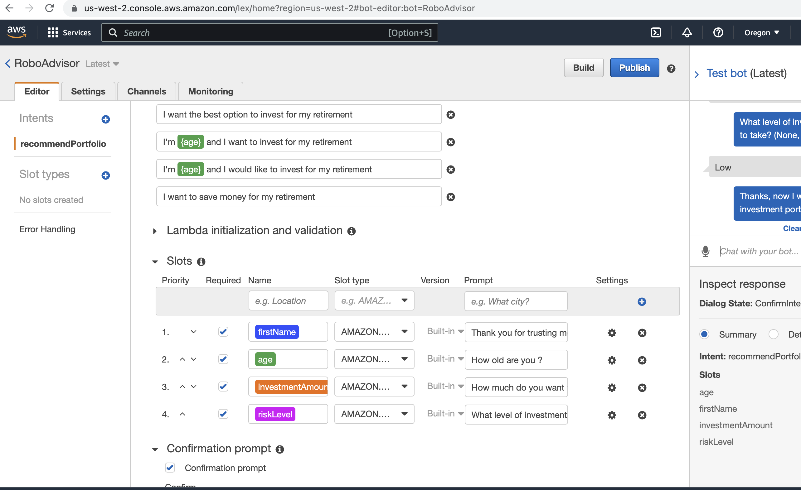

# aws_robo_advisor

In this Challenge, you’ll combine your new AWS skills with your existing Python superpowers to create a bot that will recommend an investment portfolio for a retirement plan.

You’ll be asked to accomplish the following main tasks:

Configure the initial robo advisor: Define an Amazon Lex bot with a single intent that establishes a conversation about requirements to suggest an investment portfolio for retirement.

Build and test the robo advisor: Make sure that your bot works and accurately responds during the conversation with the user.

Enhance the robo advisor with an Amazon Lambda function: Create an Amazon Lambda function that validates the user's input and returns the investment portfolio recommendation. This includes testing the Amazon Lambda function and integrating it with the bot.

---

## Technologies

This project leverages python 3.8.15 with the following packages:

* [amazon lex](https://aws.amazon.com/lex/) - For building chat bot
* [amazon lambda](https://aws.amazon.com/lambda/) - For Amazon Lambda function

---

RoboAdvisor

---

## Contributors

Kausar Hina

---

## License

MIT

